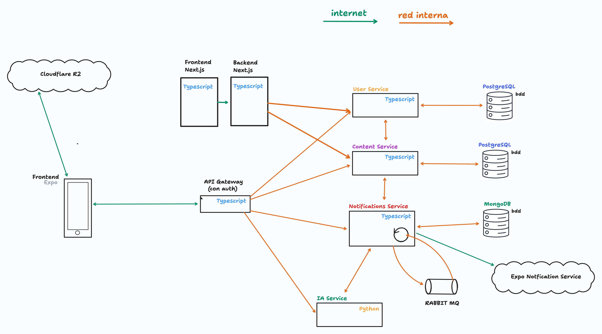
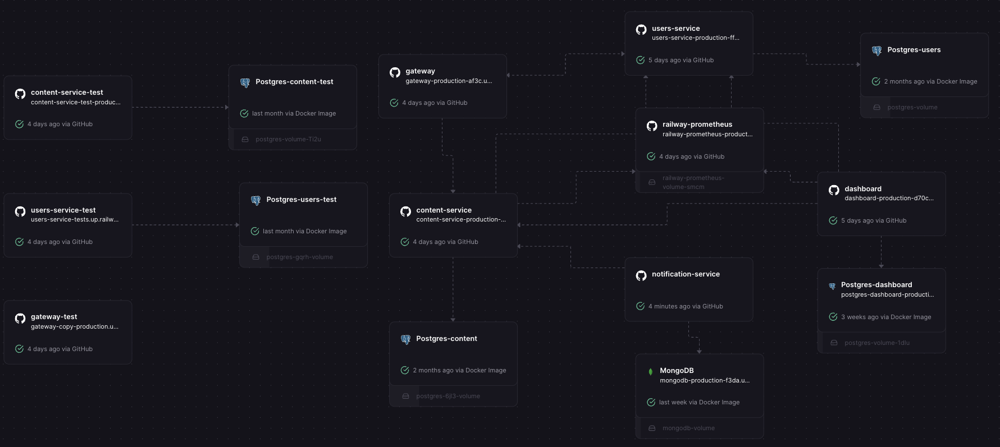

# Informe Final del Proyecto Melodía

Este documento sirve como informe final a modo de bitácora para el proyecto Melodía, una plataforma de streaming de música desarrollada con una arquitectura de microservicios moderna. Esta aplicación permite reproducir canciones, publicar colecciones y crear playlists en base a un catálogo de contenido que ofrecen los artistas de la plataforma.

## Integrantes del Grupo 7

**Materia:** Ingeniería de Software 2 - Cátedra Rojas

| Nombre y Apellido         | Padrón | Mail                   |
| ------------------------- | ------ | ---------------------- |
| Siro Fatala               | 109669 | <sfatala@fi.uba.ar>    |
| Mateo Daniel Vroonland    | 109635 | <mvroonland@fi.uba.ar> |
| Gian Luca Spagnolo        | 108072 | <gspagnolo@fi.uba.ar>  |
| Melina Belén Jáuregui     | 109524 | <mjauregui@fi.uba.ar>  |
| Juan Pablo Carosi Warburg | 109386 | <jcarosi@fi.uba.ar>    |

Nuestro tutor para este proyecto fue: Gastón Mariano Frenkel - <gfrenkel@fi.uba.ar>

## Tabla de Contenidos

- [Informe Final del Proyecto Melodía](#informe-final-del-proyecto-melodía)
  - [Integrantes del Grupo 7](#integrantes-del-grupo-7)
  - [Tabla de Contenidos](#tabla-de-contenidos)
  - [Arquitectura Propuesta](#arquitectura-propuesta)
  - [Diagramas de Arquitectura](#diagramas-de-arquitectura)
    - [Vista Conceptual (Diagrama de Arquitectura)](#vista-conceptual-diagrama-de-arquitectura)
    - [Vista Física (Diagrama de Railway)](#vista-física-diagrama-de-railway)
    - [Evolución de la Arquitectura](#evolución-de-la-arquitectura)
  - [Decisiones de Implementación](#decisiones-de-implementación)
    - [1. Arquitectura de Microservicios](#1-arquitectura-de-microservicios)
      - [Content Service](#content-service)
      - [User Service](#user-service)
      - [Notifications Service](#notifications-service)
      - [AI Service](#ai-service)
      - [Gateway](#gateway)
    - [2. Selección del Stack Tecnológico](#2-selección-del-stack-tecnológico)
      - [Lenguajes de Programación Elegidos](#lenguajes-de-programación-elegidos)
      - [Frameworks y Bases de Datos Utilizadas](#frameworks-y-bases-de-datos-utilizadas)
    - [3. Detalles de Implementación](#3-detalles-de-implementación)
  - [Herramientas de Gestión Utilizadas](#herramientas-de-gestión-utilizadas)
  - [Funcionalidades Incompletas y Errores Conocidos](#funcionalidades-incompletas-y-errores-conocidos)
  - [Problemas Encontrados y Lecciones Aprendidas](#problemas-encontrados-y-lecciones-aprendidas)

## Arquitectura Propuesta

Se propuso una arquitectura de microservicios, con un API Gateway que se encarga de la autenticación y enrutamiento a los servicios correspondientes, y los servicios se encargan de la lógica y persistencia de datos.
Se tiene tambien un dashboard escrito en Next.js que se encarga de la administración de la plataforma. Todos los servicios se comunican entre si mediante la red interna de Railway, por lo que solo el gateway esta expuesto a internet, que nos permitió tener el auth centralizado en el gateway y el backend del dashboard.

## Diagramas de Arquitectura

### Vista Conceptual (Diagrama de Arquitectura)

### Vista Física (Diagrama de Railway)

### Evolución de la Arquitectura

Cuando comenzamos con el desarrollo de nuestra plataforma, tuvimos diferentes propuestas las cuales fueron evolucionando a medida que pasaron las semanas del desarrollo. Al principio, habíamos planificado una arquitectura centralizada con una única base de datos para los servicios, pero esta idea fue descartada rapidamente para cumplir con la división de cada servicio, donde cada uno tiene su propia base de datos en caso de ser necesario.

Un servicio el cual hemos tenido en mucha consideración fue nuestra planificación del Content Service, el cual buscamos poder organizar de forma centralizada el contenido de la plataforma dentro de un mismo servicio. Esto ha generado que su respectiva base de datos sea grande, pero las interacciones entre colecciones, playlists y canciones se vuelven más efectivas y menos complejas.

De esta forma, para el segundo checkpoint, nuestra arquitectura ya quedó con una base definida muy solida sobre la cual logramos implementar los servicios correspondientes.

## Decisiones de Implementación

### 1. Arquitectura de Microservicios

Optamos por separar la lógica en servicios independientes (`content-service`, `users-service`, `notification-service` y `ai-service`) orquestados por un `gateway`.

Esta división nos permite escalar cada componente de forma aislada, cada uno manejando su propia logica y sus propios datos, encapsulando la complejidad, con los servicios comunicandose entre si mediante APIs bien definidas (mediante OpenAPI). Además, nos permitió trabajar en paralelo en distintos dominios sin pisarnos el código.

#### Content Service

Este servicio es el núcleo del catálogo musical de la plataforma. Se encarga de gestionar canciones, colecciones (álbumes, EPs, singles), playlists y géneros musicales. Expone endpoints para la creación y edición de contenido por parte de los artistas, búsqueda y listado de canciones, y administración del catálogo (bloqueo de contenido, por parte del Backoffice). También maneja el feed de actividad y las canciones marcadas como favoritas (liked songs) por los usuarios. Se comunica con el `user-service` para obtener información de artistas y con el `notification-service` para programar notificaciones cuando se publica nuevo contenido.

#### User Service

Gestiona todo lo relacionado con los usuarios de la plataforma, tanto listeners como artistas. Maneja la autenticación mediante Better Auth, perfiles de usuario, el sistema de seguidores (follow/unfollow), preferencias de géneros y artistas favoritos. También administra los tokens de push notifications para cada dispositivo, las preferencias de notificaciones, y el sistema de ban/unban de usuarios del administrador. Adicionalmente, expone métricas de usuarios para el dashboard y envía emails transaccionales (como recuperación de contraseña) mediante React Email y Resend.

#### Notifications Service

Se encarga del sistema de notificaciones push de la plataforma. Cuando un artista publica nuevo contenido (canciones o colecciones), el `content-service` programa una notificación en este servicio. Las notificaciones se almacenan en MongoDB con una fecha de envío programada, y un cron job las procesa periódicamente. Al momento del envío, el servicio consulta los seguidores del artista, encola los mensajes en RabbitMQ, y un worker los consume para enviarlos a través de la API de Expo Push Notifications.

#### AI Service

Proporciona funcionalidades de inteligencia artificial para la plataforma. Su principal característica es el autocompletado de metadatos: cuando un artista está creando una canción, este servicio sugiere títulos creativos, géneros apropiados, colecciones donde incluirla y posibles colaboradores, todo basado en el contexto proporcionado. Utiliza la API de OpenAI para generar estas sugerencias de forma inteligente, procesando los prompts y parseando las respuestas estructuradas.

#### Gateway

Implementamos un API Gateway que actúa como único punto de entrada para los clientes (la App frontend). Este se encarga de la validación de sesión centralizada para cada request que lo atraviesa y el enrutamiento a los servicios correspondientes, simplificando la lógica en las aplicaciones cliente, donde se tiene un único entrypoint (tipado por OpenAPI) para interactuar todos los servicios de la plataforma de forma agnóstica.

### 2. Selección del Stack Tecnológico

#### Lenguajes de Programación Elegidos

- **Node.js + Bun:** Para la mayoría de los servicios del backend (`gateway`, `content-service`, `users-service`, `notification-service`) elegimos Node.js con Bun como runtime. Esta decisión fue tomada por varios factores: primero, el excelente rendimiento de Bun que supera a Node.js tradicional en tiempos de arranque y ejecución; segundo, la integración nativa con TypeScript que nos permite mantener type-safety end-to-end desde las definiciones de OpenAPI hasta las respuestas de los endpoints; y tercero, la familiaridad del equipo con el ecosistema JavaScript/TypeScript, lo que aceleró significativamente el desarrollo. Estos servicios manejan operaciones CRUD, gestión de sesiones y comunicación HTTP entre microservicios, tareas donde Node.js brilla por su modelo asíncrono basado en eventos.
- **Python + FastAPI:** Para el `ai-service` optamos por Python con FastAPI. Esta elección fue estratégica dado que el servicio se encarga de funcionalidades de inteligencia artificial, incluyendo el autocompletado de metadatos de canciones mediante integración con la API de OpenAI. Python es considerado como un estándar en el ecosistema de IA, con bibliotecas maduras como el SDK oficial de OpenAI ya integradas en el servicio. FastAPI nos ofrece rendimiento asíncrono comparable a Node.js gracias a Uvicorn, junto con validación automática de datos mediante Pydantic y documentación OpenAPI generada automáticamente, manteniendo la consistencia con el resto de servicios.

#### Frameworks y Bases de Datos Utilizadas

- **Hono:** Para los servicios backend, utilizamos Hono. Es un framework extremadamente ligero y rápido que soporta los estándares Web API. Su integración con TypeScript, Zod y OpenAPI para la validación de esquemas nos permitió definir contratos de API claros y seguros.
- **OpenAPI Fetch** Para la comunicacion entre servicios (tanto interna entre servicios como la app con el gateway) utilizamos OpenAPI Fetch, una libreria que permite hacer requests HTTP tipadas a partir de esquemas OpenAPI, facilitando la comunicacion entre servicios a la hora de definir los endpoints y poder recibir en cada request el tipo de respuesta esperado.
- **PostgreSQL & Prisma:** Para la persistencia de datos estructurados (usuarios, metadatos de canciones, playlists), confiamos en la robustez de PostgreSQL junto con Prisma como ORM. Prisma nos facilitó mantener un esquema de datos coherente y tipado end-to-end en conjunto con las definiciones de OpenAPI.
- **MongoDB (Notification Service):** Para el servicio de notificaciones optamos por MongoDB. Este servicio gestiona notificaciones programadas (scheduled notifications) que se envían a los seguidores de un artista cuando publica nuevo contenido (canciones o colecciones). MongoDB resultó ideal para este caso de uso debido a que las notificaciones tienen un ciclo de vida temporal (estados PENDING, SENT, BLOCKED), no requieren relaciones complejas con otras entidades, y se benefician de la flexibilidad de esquema para almacenar diferentes tipos de contenido. Un cron job procesa periódicamente las notificaciones pendientes cuya fecha de envío ya pasó, consultando eficientemente por estado y fecha gracias a los índices de MongoDB.
- **Cloudflare R2:** Para el almacenamiento de archivos estaticos (como las imagenes de los usuarios y las canciones), utilizamos Cloudflare R2, un almacenamiento de objetos similar a S3 pero mas economico y con un mejor rendimiento.
- **Expo & React Native:** Para la aplicación móvil, Expo fue la elección natural para iterar rápido en Android debido a la previa experiencia del equipo en React.
- **Next.js (aplicado en el Dashboard):** Para el panel de administración, aprovechamos mantenernos en React al igual que la App, utilizando Next.js como framework fullstack, lo que nos permitió configurar un RPC (librería oRPC) para poder tener un ciclo completo desde los servicios, al backend del frontend, al frontend completamente typesafe con inferencia de los tipos desde el OpenAPI y Prisma.
- **Better Auth:** Utilizamos Better Auth para la autenticación y gestión de usuarios, tanto para la App frontend como para el Dashboard.

### 3. Detalles de Implementación

- **Conexion con R2:** Para subir archivos a R2, se utilizaron pre-signed urls, que son urls que se generan en el backend y que son validas para un tiempo determinado, para luego ser utilizadas por el frontend para subir el archivo a R2, ahorrandonos la necesidad de tener un servidor intermedio para subir los archivos, reduciendo tanto la complejidad de pasar archivos grandes a traves del backend como el costo del bandwidth en la plataforma cloud.
- **Dashboard:** El dashboard fue implementado como un microservicio separado, con su propio backend, su propio auth y propio entrypoint al sistema. Esta desicion se baso en la necesidad de tener un sistema de administración de la plataforma, que no sea parte de la app frontend, y que tenga su propio auth, separado del de usuarios de la app para ademas poder monitorear el estado de los servicios y la plataforma en general.
- **Testing:** Se implementaron tests para cada servicio, y para cada uno de estos se puso en produccion una imagen de docker que se encarga de ejecutar los tests y generar el coverage, publicandolos en una pagina web para que se pueda ver el coverage de cada servicio.
- **Sistema de Queues con RabbitMQ:** Para el envío de push notifications implementamos un sistema de colas utilizando RabbitMQ como message broker. Esto fue necesario ya que firebase no permite programar notificaciones para el futuro, un feature requerido para lanzar notificaciones al publicar una cancion. Para llevar esto a cabo implementamos un cronjob que revisa cada un minuto notificaciones pendientes a enviar en ese minuto, y cuando detecta notificaciones pendientes, encola un mensaje por cada seguidor del artista en una cola durable. Un worker consume estos mensajes de forma asíncrona y envía las notificaciones push a través de la API de Expo (wrapper que multiplexa las conexiones a Firebase o a Apple Push Notification Service). Este patrón productor-consumidor nos permite desacoplar el procesamiento de notificaciones del flujo principal, garantizar la entrega de mensajes mediante acknowledgements manuales (ack/nack), y controlar la concurrencia con prefetch para evitar tener rate limitings en la API de Expo y asegurarnos de que no se pierdan notificaciones ante reinicios del servicio. Tambien se garantiza una persistencia de los mensajes, que asegura que no se pierdan notificaciones ante reinicios del servicio.

## Herramientas de Gestión Utilizadas

Para la planificación del trabajo en grupo a lo largo del cuatrimestre, comenzamos utilizando Github Projects para organizar el estado en el que se realizaba cada User Story. Sin embargo, a medida que pasaron los checkpoints, nuestra organización se centralizaba en una [Planilla de Google Sheets](https://docs.google.com/spreadsheets/d/1iPiyfxuHMG8mmjgYkiyn5bJN19Bk_cwoJ4RCfyAvIMw/edit?usp=sharing) la cual contiene todo el backlog de nuestro producto, la cantidad de User Stories realizadas y los puntos conseguidos, organizados por cada checkpoint.

## Funcionalidades Incompletas y Errores Conocidos

A pesar de nuestros esfuerzos, existen áreas que quedaron pendientes o que podrían mejorarse en futuras iteraciones:

- **Sincronización Offline en Mobile:** La aplicación reproduce música en streaming, pero la funcionalidad de descargar canciones para escucha offline ("Modo Avión") quedó marcada como una mejora futura, dado que fue elegido priorizar la funcionalidad de la app y recomendaciones sobre la sincronización offline.
- **Búsqueda Avanzada:** Actualmente, la búsqueda se realiza directamente sobre la base de datos. Para un catálogo masivo, sería ideal integrar un motor de búsqueda dedicado como Elasticsearch para manejar typos y relevancia de mejor manera.

## Problemas Encontrados y Lecciones Aprendidas

El camino no estuvo exento de desafíos. Aquí algunas de las lecciones más valiosas que nos llevamos:

- **La complejidad de lo distribuido:** Al principio subestimamos la complejidad de depurar errores que atraviesan múltiples servicios. Implementar un buen logging y tracing fue vital para no perdernos cuando una petición fallaba entre el Gateway y un microservicio.
- **Manejo de Estado en Móvil:** A pesar que React Native es muy similar a React web, tiene ciertas diferencias a la hora de manejar estados, como por ejemplo que las paginas no vuelven a renderizarse al cambiar de ruta como sucede en web.

Más alla de estos desafios que han aparecido al momento de implementar cada parte de la plataforma, este proyecto ha servido como una gran fuente del aprendizaje de múltiples tecnologías tanto para el backend como para el frontend. Analizando la totalidad de nuestra implementación, consideramos hacer énfasis en las buenas prácticas aplicadas y el prolijo armado de nuestra aplicación frontend, cumpliendo cada una de las tareas y funcionalidades pactadas y garantizando una buena experiencia de usuario, aprovechando el diseño de la aplicación ya existente Spotify, de modo que sea similar en cuanto a organización. De esta forma, logramos entregar una interfaz amigable y conocida, como también con nuestro toque original.
